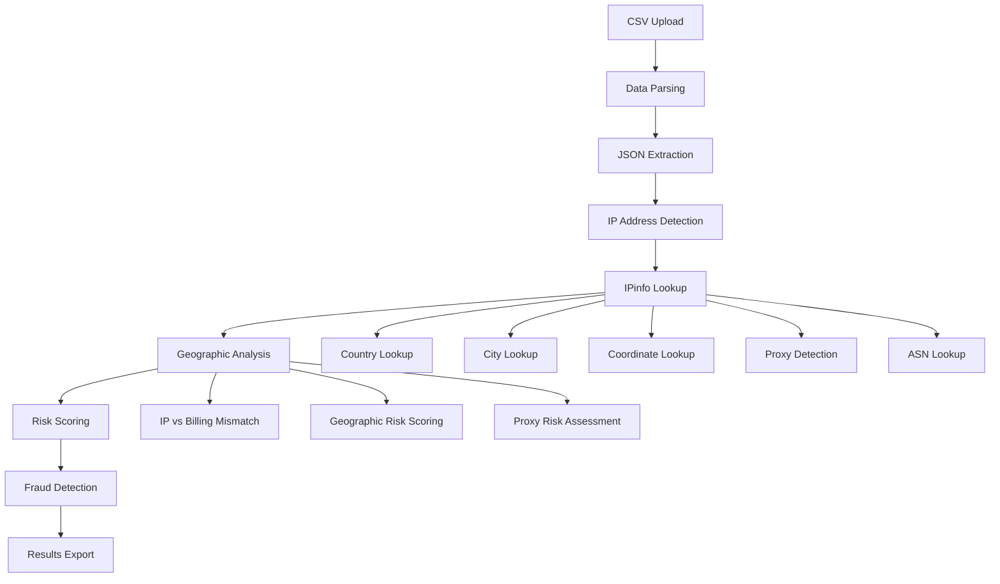

# IPinfo Database Integration for Fraud Detection

## Overview

This project now includes enhanced fraud detection capabilities using the **IPinfo Lite MMDB database** for accurate IP geolocation. The integration provides precise geographic analysis to detect fraud patterns based on IP address vs. billing address mismatches.

## 🆕 New Features

### 1. **IPinfo Database Integration**
- **Local MMDB Database**: Uses `ipinfo_lite.mmdb` (54MB) for offline IP geolocation
- **High Accuracy**: Provides country, city, coordinates, ASN, and proxy detection
- **No API Calls**: All lookups are performed locally for privacy and speed

### 2. **Enhanced Fraud Detection**
- **Geographic Mismatch Detection**: Identifies transactions where IP location differs from billing address
- **Proxy Detection**: Flags transactions from anonymous proxies and VPNs
- **ASN Analysis**: Identifies suspicious network providers
- **Coordinate Mapping**: Visualizes geographic mismatches on interactive maps

### 3. **Risk Scoring System**
- **Multi-factor Risk Calculation**: Combines velocity, geographic, and behavioral patterns
- **Configurable Thresholds**: Adjustable risk scoring parameters
- **Risk Factor Documentation**: Clear explanation of why each transaction is flagged

## 📁 New Applications

### 1. **Fraud Detection App** (`fraud_detection_app.py`)
- **Comprehensive fraud analysis** with IPinfo integration
- **Real-time risk scoring** and visualization
- **Export functionality** for high-risk transactions

### 2. **Enhanced Geographic Analysis** (`enhanced_geographic_analysis.py`)
- **Advanced geographic fraud detection** using IPinfo database
- **Interactive maps** showing geographic mismatches
- **Detailed risk analysis** with multiple risk factors

### 3. **IPinfo Test Script** (`test_ipinfo.py`)
- **Database connectivity testing**
- **Sample IP address validation**
- **Integration verification**

## 🚀 Installation & Setup

### 1. **Install Dependencies**
```bash
pip install -r requirements.txt
```

**New packages added:**
- `geoip2>=4.7.0` - IPinfo database reader
- `maxminddb>=2.4.0` - MMDB file format support

### 2. **Verify Database File**
Ensure `ipinfo_lite.mmdb` is in your project directory:
```bash
ls -la ipinfo_lite.mmdb
# Should show ~54MB file
```

### 3. **Test Integration**
```bash
python test_ipinfo.py
```

## 🔧 Usage

### Running the Fraud Detection App
```bash
streamlit run fraud_detection_app.py
```

### Running the Enhanced Geographic Analysis
```bash
streamlit run enhanced_geographic_analysis.py
```

## 📊 Data Processing Flow



## 🌍 Geographic Analysis Features

### 1. **IP Geolocation Data**
- **Country**: ISO country code and full name
- **City**: City name and region
- **Coordinates**: Latitude and longitude
- **Timezone**: Local timezone information
- **Postal Code**: ZIP/postal code when available

### 2. **Network Information**
- **ASN**: Autonomous System Number
- **Organization**: ISP/network provider name
- **Connection Type**: Cable, DSL, mobile, etc.
- **User Type**: Business, residential, etc.

### 3. **Security Features**
- **Proxy Detection**: Anonymous proxy, VPN, satellite provider detection
- **Risk Assessment**: Geographic mismatch scoring
- **Pattern Analysis**: Suspicious location patterns

## 🎯 Risk Scoring Algorithm

### Risk Factors & Scores

| Risk Factor | Score | Description |
|-------------|-------|-------------|
| **Geographic Mismatch** | +3 | IP country ≠ Billing country |
| **High Velocity** | +2 | >5 transactions per user |
| **Critical Velocity** | +2 | >10 transactions per user |
| **Suspicious Amounts** | +2 | Known fraud test amounts |
| **Rapid Succession** | +1 | <5 minutes between transactions |

### Risk Levels
- **Low Risk**: 0-4 points
- **Medium Risk**: 5-7 points  
- **High Risk**: 8-10 points
- **Critical Risk**: 11+ points

## 📈 Fraud Detection Capabilities

### 1. **Geographic Fraud**
- **Cross-border transactions**: IP from one country, billing from another
- **Proxy/VPN usage**: Anonymous proxy detection
- **Suspicious locations**: High-risk geographic areas

### 2. **Behavioral Fraud**
- **Velocity attacks**: Multiple rapid transactions
- **Amount testing**: Small amounts followed by large amounts
- **Time anomalies**: Unusual transaction timing

### 3. **Device Fingerprinting**
- **User agent analysis**: Browser/device consistency
- **IP patterns**: Multiple accounts from same IP
- **Session analysis**: Suspicious session patterns

## 🔍 Example Analysis

### Sample Fraud Detection Output
```
🚨 High-Risk Transaction Detected
User: john.doe@example.com
Amount: €50.00
Risk Score: 8/10
Risk Factors: Geographic Mismatch; High Velocity; Rapid Succession

IP Location: 31.0.95.177 → Poland (PL)
Billing Address: Romania (RO)
Velocity: 6 transactions in 1 hour
Time Gap: 2 minutes between transactions
```

## 📤 Export & Reporting

### 1. **High-Risk Transactions Export**
- CSV format with all risk factors
- Filtered by risk score threshold
- Includes geographic mismatch details

### 2. **Full Analysis Export**
- Complete dataset with risk scores
- All IPinfo geolocation data
- Risk factor explanations

### 3. **Geographic Summary Reports**
- Country mismatch statistics
- Risk distribution by region
- Proxy usage patterns

## 🛠️ Configuration

### Risk Thresholds
```python
RISK_THRESHOLDS = {
    'velocity_high': 5,      # High velocity threshold
    'velocity_critical': 10, # Critical velocity threshold
    'geo_mismatch_score': 3, # Geographic mismatch score
    'velocity_score': 2,     # Velocity violation score
    'amount_score': 2,       # Suspicious amount score
    'time_score': 1,         # Time anomaly score
}
```

### IP Column Detection
The system automatically detects IP address columns:
- `ip`, `client_ip`, `t.ip`
- `headers.x-forwarded-for`
- Custom column names

## 🔒 Privacy & Security

### 1. **Local Processing**
- **No external API calls**: All lookups performed locally
- **Data privacy**: Transaction data never leaves your system
- **Offline capability**: Works without internet connection

### 2. **Database Security**
- **Read-only access**: MMDB database is read-only
- **No data collection**: No usage analytics or tracking
- **Secure storage**: Database file can be encrypted if needed

## 🚨 Troubleshooting

### Common Issues

#### 1. **IPinfo Packages Not Available**
```bash
pip install geoip2 maxminddb
```

#### 2. **Database File Not Found**
- Ensure `ipinfo_lite.mmdb` is in project directory
- Check file permissions
- Verify file integrity

#### 3. **Import Errors**
```bash
python test_ipinfo.py
# Run test script to diagnose issues
```

#### 4. **Performance Issues**
- Large datasets may take time to process
- Progress bars show processing status
- Consider processing in batches for very large files

## 📚 API Reference

### IPinfoGeolocator Class

```python
class IPinfoGeolocator:
    def __init__(self, db_path: str = "ipinfo_lite.mmdb")
    def initialize_database(self)
    def get_location(self, ip: str) -> Dict[str, Any]
    def close(self)
```

### Key Methods

#### `get_location(ip: str)`
Returns comprehensive location data for an IP address:
```python
{
    'country': 'US',
    'country_name': 'United States',
    'city': 'New York',
    'latitude': 40.7128,
    'longitude': -74.0060,
    'proxy': False,
    'asn': 15169,
    'org': 'Google LLC'
}
```

## 🔮 Future Enhancements

### Planned Features
- **Machine Learning Integration**: ML-based risk scoring
- **Real-time Monitoring**: Live transaction analysis
- **Advanced Analytics**: Network graph analysis
- **Custom Risk Rules**: User-defined fraud patterns
- **API Integration**: External fraud detection services

### Performance Improvements
- **Batch Processing**: Optimized for large datasets
- **Caching**: IP lookup result caching
- **Parallel Processing**: Multi-threaded IP analysis

## 📞 Support

### Getting Help
1. **Run test script**: `python test_ipinfo.py`
2. **Check requirements**: Ensure all packages are installed
3. **Verify database**: Confirm MMDB file exists and is valid
4. **Review logs**: Check Streamlit console for error messages

### Common Solutions
- **Package conflicts**: Use virtual environment
- **Memory issues**: Process data in smaller chunks
- **Performance**: Close other applications during processing

---

**🎉 Congratulations!** You now have a powerful fraud detection system with IPinfo database integration for enhanced geographic analysis and fraud detection.
