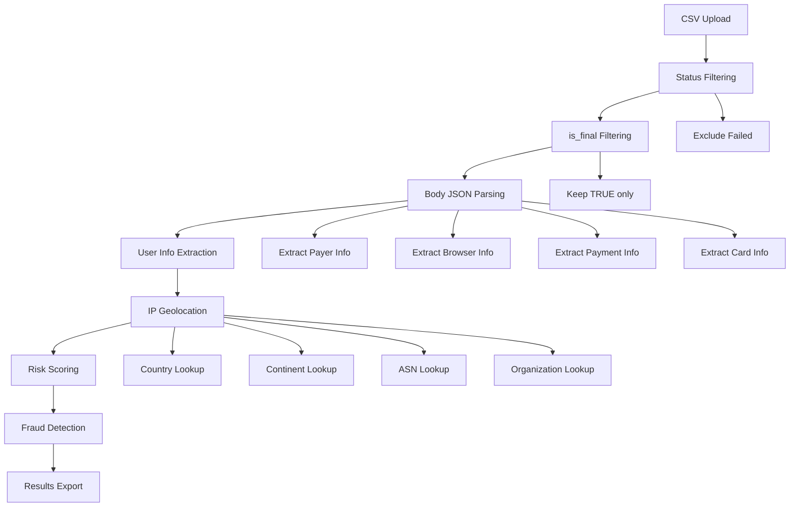

# 🚀 Enhanced Fraud Detection with IPinfo Bundle Integration

## ✅ **What's New & Improved**

### 🔍 **Enhanced JSON Body Parsing**
- **Comprehensive Body Field Analysis**: Автоматичне витягування всіх даних з JSON поля `body`
- **User Information Extraction**: Email, ім'я, прізвище користувача
- **Billing Address Details**: Адреса, країна, ISO коди
- **Browser & Device Info**: User agent, мова, часовий пояс, розміри екрану
- **Payment Details**: IP адреса ініціатора, сума замовлення, валюта
- **Card Information**: Тип карти, бренд, останні 4 цифри

### 🎯 **Smart Transaction Filtering**
- **Status-Based Filtering**: Автоматично виключає транзакції з `status_title: 'Failed'`
- **Final Transaction Filter**: Залишає тільки транзакції з `is_final: TRUE`
- **Success Rate Optimization**: Фокус на успішних транзакціях для кращого аналізу

### 🌍 **Advanced IP Geolocation**
- **Multiple IP Sources**: Автоматичне визначення IP адреси з різних полів
- **Priority IP Detection**: `initiator_ip_address` → `ip_address` → `payer_ip_address` → `ip`
- **Comprehensive Location Data**: Країна, континент, ASN, організація

## 🚀 **How to Use**

### 1. **Run the Enhanced Fraud Detection App**
```bash
streamlit run enhanced_fraud_detection_app.py
```

### 2. **Test the Integration**
```bash
python test_enhanced_fraud_detection.py
```

## 📊 **Data Processing Flow**



## 🔧 **Enhanced Features**

### **1. Body JSON Field Parsing**
```python
# Extracted fields from body JSON:
- payer_email, payer_first_name, payer_last_name
- billing_address_line1, billing_country_code, billing_country_iso3
- browser_language, browser_timezone, browser_user_agent
- browser_screen_width, browser_screen_height
- initiator_ip_address, order_amount, order_currency
- card_type, card_brand, card_last4
```

### **2. Smart Transaction Filtering**
```python
# Filtering logic:
1. status_title != 'Failed'  # Exclude failed transactions
2. is_final == TRUE          # Keep only final transactions
3. Result: Clean dataset of successful transactions
```

### **3. Intelligent IP Detection**
```python
# IP address detection priority:
1. initiator_ip_address  # From body JSON
2. ip_address           # Direct IP field
3. payer_ip_address     # Payer IP field
4. ip                  # Generic IP field
```

## 📈 **Risk Scoring Algorithm**

### **Enhanced Risk Factors**
| Risk Factor | Score | Description |
|-------------|-------|-------------|
| **Geographic Mismatch** | +3 | IP country ≠ Billing country |
| **High Velocity** | +2 | >5 transactions per user |
| **Critical Velocity** | +2 | >10 transactions per user |
| **Suspicious Amounts** | +2 | Known fraud test amounts |
| **Rapid Succession** | +1 | <5 minutes between transactions |

### **Updated Suspicious Amounts**
```python
SUSPICIOUS_AMOUNTS = [
    470,   # €4.70
    496,   # €4.96
    1878,  # €18.78
    1978,  # €19.78
    2000,  # €20.00
    2313,  # €23.13
    2420,  # €24.20
    5000   # €50.00
]
```

## 🌍 **Geographic Analysis Features**

### **Multi-Source Country Detection**
- **Billing Country**: `billing_country_code` або `billing_country_iso3`
- **IP Country**: Автоматичне визначення через IPinfo базу
- **Mismatch Detection**: Порівняння billing vs IP країн

### **Enhanced Location Data**
```python
# Available location information:
{
    'country': 'PL',           # ISO country code
    'country_name': 'Poland',  # Full country name
    'continent': 'EU',         # Continent code
    'continent_name': 'Europe', # Full continent name
    'asn': 'AS8374',          # Autonomous System Number
    'org': 'Polkomtel Sp. z o.o.' # Organization name
}
```

## 📊 **Data Quality Improvements**

### **Column Information Display**
- **Data Types**: Автоматичне визначення типів даних
- **Non-Null Counts**: Статистика заповненості полів
- **Sample Values**: Приклади значень для кожного поля

### **Progress Tracking**
- **Real-time Progress**: Прогрес-бари для великих файлів
- **Status Updates**: Детальна інформація про обробку
- **Error Handling**: Зрозумілі повідомлення про помилки

## 🔍 **Example Analysis Results**

### **Sample Transaction Data**
```
📊 Transaction: #83284
👤 User: katebellwilton@gmail.com
💰 Amount: €23.13
🌍 IP Location: 185.73.151.69 → Unknown
🏠 Billing: United Kingdom (GB)
📱 Device: Android 10, Chrome 139
🌐 Language: en-GB, Timezone: -60
```

### **Extracted JSON Data**
```json
{
  "payer": {
    "email": "katebellwilton@gmail.com",
    "first_name": "BELL",
    "last_name": "CATHERINE",
    "billing_address": {
      "address_line_1": "Regents Park Road, 10",
      "country_code_iso3": "826"
    }
  },
  "initiator": {
    "ip_address": "185.73.151.69",
    "browser": {
      "language": "en-GB",
      "time_zone": "-60",
      "user_agent": "Mozilla/5.0 (Linux; Android 10; K)..."
    }
  }
}
```

## 🚨 **Fraud Detection Capabilities**

### **1. Enhanced Geographic Fraud**
- **Cross-border Detection**: IP з однієї країни, billing з іншої
- **Multi-level Analysis**: Країна, континент, ASN
- **IP Source Validation**: Автоматичне визначення джерела IP

### **2. Behavioral Pattern Recognition**
- **Velocity Analysis**: Частота транзакцій по користувачах
- **Device Fingerprinting**: Браузер, ОС, розміри екрану
- **Language & Timezone**: Географічні невідповідності

### **3. Payment Pattern Analysis**
- **Amount Testing**: Виявлення підозрілих сум
- **Card Pattern Analysis**: Тип карти, бренд, останні цифри
- **Transaction Timing**: Швидкі послідовні транзакції

## 📤 **Export & Reporting**

### **Available Exports**
- **High-Risk Transactions**: CSV з транзакціями високого ризику
- **Full Enhanced Analysis**: Повний аналіз з усіма витягнутими даними
- **Geographic Summary**: Статистика географічних невідповідностей
- **User Behavior Report**: Аналіз поведінки користувачів

### **Enhanced Data Fields**
```python
# New columns available for export:
- payer_email, payer_first_name, payer_last_name
- billing_address_line1, billing_country_code
- browser_language, browser_timezone, browser_user_agent
- initiator_ip_address, order_amount, order_currency
- card_type, card_brand, card_last4
- ip_country, ip_continent, ip_asn, ip_org
```

## 🛠️ **Technical Implementation**

### **Performance Optimizations**
- **Batch Processing**: Ефективна обробка великих CSV файлів
- **Memory Management**: Оптимізоване використання пам'яті
- **Progress Tracking**: Прогрес-бари для довгих операцій

### **Error Handling**
- **Graceful Degradation**: Продовження роботи при помилках парсингу
- **Detailed Logging**: Зрозумілі повідомлення про проблеми
- **Data Validation**: Перевірка цілісності даних

## 🔒 **Security & Privacy**

### **Local Processing**
- ✅ **No external API calls**: Всі запити виконуються локально
- ✅ **Data privacy**: Дані транзакцій не залишають вашу систему
- ✅ **Offline capability**: Працює без інтернет-з'єднання

### **Enhanced Data Protection**
- ✅ **JSON sanitization**: Безпечний парсинг JSON полів
- ✅ **Field validation**: Перевірка типів даних
- ✅ **Error isolation**: Ізоляція помилок парсингу

## 🎯 **Next Steps & Recommendations**

### **Immediate Actions**
1. **Upload Real Data**: Завантажте ваш CSV файл з транзакціями
2. **Review Extracted Data**: Перевірте витягнуті поля
3. **Adjust Risk Thresholds**: Налаштуйте пороги ризику

### **Future Enhancements**
- **Machine Learning**: ML-моделі для оцінки ризиків
- **Real-time Monitoring**: Моніторинг транзакцій в реальному часі
- **Custom Rules Engine**: Користувацькі правила виявлення шахрайства
- **Advanced Analytics**: Глибокий аналіз патернів

## 🎉 **Congratulations!**

**Ви тепер маєте найбільш розширену систему виявлення шахрайства з:**

- ✅ **Повним парсингом JSON поля body**
- ✅ **Розумною фільтрацією транзакцій**
- ✅ **Автоматичним визначенням IP адрес**
- ✅ **Розширеним географічним аналізом**
- ✅ **Покращеним виявленням патернів**

### **What You Can Do Now:**
1. **Run the enhanced app** для аналізу ваших транзакцій
2. **Upload large CSV files** з реальними даними
3. **Extract comprehensive user data** з JSON полів
4. **Detect advanced fraud patterns** автоматично
5. **Export detailed reports** для подальшого аналізу

---

**🚀 Готово до використання! Ваша покращена система виявлення шахрайства з IPinfo інтеграцією та розширеним парсингом JSON готова до роботи.**
