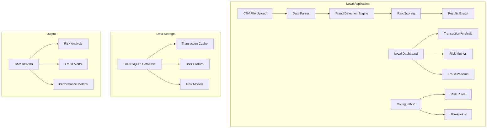

# Fraud Detection & Transaction Analysis Application
## Simplified Local Development Plan (CSV-Based)

### Executive Summary
This plan outlines the development of a **local fraud detection application** designed to analyze Mastercard/Visa transactions from CSV files. The application will provide risk scoring, fraud detection, and analytics without requiring complex infrastructure or external services.

**Complexity Level: Level 2-3 (Intermediate)**
**Development Approach: Local CSV Processing**

### Simplified Application Architecture



### Core Modules (Simplified)

#### 1. **CSV Data Processing Module**
```python
# Core Components
- CSV File Parser (pandas)
- Data Validation Engine
- Local Data Storage (SQLite)
- Export Functionality

# Technologies
- Python 3.11+
- Pandas (CSV processing)
- SQLite (local database)
- OpenPyXL (Excel export)
```

#### 2. **Fraud Detection Engine**
```python
# Core Components
- Rule-Based Engine
- Risk Scoring Algorithm
- Behavioral Analytics
- Local ML Models (scikit-learn)

# Risk Factors (Simplified)
- Geographic Risk (IP vs Billing mismatch)
- Velocity Risk (transaction frequency)
- Amount Risk (suspicious amounts)
- Device Risk (basic fingerprinting)
- Temporal Risk (time patterns)
```

#### 3. **Local Dashboard & Analytics**
```python
# Core Components
- Streamlit Web Interface
- Interactive Charts (Plotly)
- Real-time Metrics
- Export Functionality

# Dashboard Features
- Transaction Overview
- Risk Score Distribution
- Geographic Visualization
- Fraud Pattern Analysis
- Performance Metrics
```

### Simplified Technology Stack

#### Backend
- **Language**: Python 3.11+
- **Framework**: Streamlit (all-in-one solution)
- **Database**: SQLite (local, no setup required)
- **Data Processing**: Pandas, NumPy
- **ML Framework**: Scikit-learn (basic models)

#### Frontend
- **Framework**: Streamlit (built-in UI components)
- **Charts**: Plotly (interactive visualizations)
- **Maps**: Folium (geographic visualization)

#### Infrastructure
- **Deployment**: Local Python environment
- **Dependencies**: pip + requirements.txt
- **Data Storage**: Local CSV files + SQLite
- **No external services required**

### Development Phases (Simplified)

#### Phase 1: Core CSV Processing (Week 1)
- CSV file parser and validator
- Basic data structure
- SQLite database setup
- Simple data export

#### Phase 2: Fraud Detection Engine (Week 2)
- Risk scoring algorithm
- Basic fraud detection rules
- Local ML model training
- Risk factor calculation

#### Phase 3: Dashboard & Analytics (Week 3)
- Streamlit interface
- Interactive visualizations
- Real-time metrics
- Export functionality

#### Phase 4: Testing & Optimization (Week 4)
- Performance testing
- Bug fixes
- Documentation
- User testing

### Simplified Database Schema

```sql
-- Core transaction table (SQLite)
CREATE TABLE transactions (
    id INTEGER PRIMARY KEY AUTOINCREMENT,
    transaction_uuid TEXT UNIQUE NOT NULL,
    user_email TEXT NOT NULL,
    amount INTEGER NOT NULL, -- Amount in cents
    currency TEXT NOT NULL,
    status TEXT NOT NULL,
    gateway_code INTEGER,
    gateway_message TEXT,
    created_at TEXT NOT NULL, -- ISO format string
    
    -- Card information
    card_bin TEXT,
    card_last4 TEXT,
    card_type TEXT,
    card_brand TEXT,
    
    -- Geographic information
    billing_country TEXT,
    ip_address TEXT,
    ip_country TEXT,
    ip_city TEXT,
    
    -- Device information
    user_agent TEXT,
    device_type TEXT,
    browser_language TEXT,
    
    -- Risk scoring
    risk_score REAL DEFAULT 0.0,
    risk_factors TEXT, -- JSON string
    
    -- Metadata
    metadata TEXT, -- JSON string
    created_at_utc TEXT DEFAULT (datetime('now'))
);

-- Risk factors lookup table
CREATE TABLE risk_factors (
    id INTEGER PRIMARY KEY AUTOINCREMENT,
    factor_name TEXT UNIQUE NOT NULL,
    factor_description TEXT,
    risk_weight REAL DEFAULT 1.0,
    is_active INTEGER DEFAULT 1,
    created_at TEXT DEFAULT (datetime('now'))
);

-- User profiles table
CREATE TABLE user_profiles (
    id INTEGER PRIMARY KEY AUTOINCREMENT,
    user_email TEXT UNIQUE NOT NULL,
    risk_profile TEXT DEFAULT 'MEDIUM',
    total_transactions INTEGER DEFAULT 0,
    successful_transactions INTEGER DEFAULT 0,
    failed_transactions INTEGER DEFAULT 0,
    total_amount INTEGER DEFAULT 0,
    first_transaction_at TEXT,
    last_transaction_at TEXT,
    created_at TEXT DEFAULT (datetime('now'))
);
```

### Core Application Structure

```
fraud_detection_app/
├── app.py                 # Main Streamlit application
├── requirements.txt       # Python dependencies
├── config/
│   ├── settings.py       # Configuration settings
│   └── risk_rules.py     # Risk detection rules
├── core/
│   ├── csv_processor.py  # CSV file processing
│   ├── fraud_engine.py   # Fraud detection logic
│   ├── risk_scoring.py   # Risk calculation
│   └── database.py       # SQLite operations
├── models/
│   ├── ml_models.py      # Machine learning models
│   └── feature_engineering.py
├── utils/
│   ├── validators.py     # Data validation
│   ├── exporters.py      # Data export
│   └── helpers.py        # Utility functions
├── data/
│   ├── input/            # Input CSV files
│   ├── output/           # Generated reports
│   └── database.db       # SQLite database
└── README.md             # Application documentation
```

### Key Features

#### 1. **CSV File Processing**
- Drag & drop CSV upload
- Automatic format detection
- Data validation and cleaning
- Support for multiple CSV formats

#### 2. **Fraud Detection**
- Real-time risk scoring
- Configurable risk rules
- Machine learning-based detection
- Behavioral pattern analysis

#### 3. **Analytics Dashboard**
- Transaction overview metrics
- Risk score distribution
- Geographic fraud patterns
- Time-based trend analysis
- Device and user analytics

#### 4. **Export & Reporting**
- CSV export with risk scores
- Excel reports with charts
- PDF summary reports
- Custom report builder

### Risk Scoring Algorithm (Simplified)

```python
class LocalRiskScoringEngine:
    def __init__(self):
        self.risk_factors = {
            'geographic_mismatch': 2.0,
            'velocity_risk': 3.0,
            'amount_risk': 2.0,
            'device_risk': 1.5,
            'temporal_risk': 1.0,
            'behavioral_risk': 2.0
        }
    
    def calculate_risk_score(self, transaction, user_history):
        total_score = 0.0
        
        # Geographic risk
        if transaction.billing_country != transaction.ip_country:
            total_score += self.risk_factors['geographic_mismatch']
        
        # Velocity risk (transactions per hour)
        velocity_score = self.calculate_velocity_risk(user_history)
        total_score += velocity_score * self.risk_factors['velocity_risk']
        
        # Amount risk
        amount_score = self.calculate_amount_risk(transaction.amount, user_history)
        total_score += amount_score * self.risk_factors['amount_risk']
        
        # Device risk
        device_score = self.calculate_device_risk(transaction, user_history)
        total_score += device_score * self.risk_factors['device_risk']
        
        return min(total_score, 10.0)  # Cap at 10.0
    
    def make_decision(self, risk_score):
        if risk_score < 3.0:
            return 'APPROVE'
        elif risk_score < 7.0:
            return 'REVIEW'
        else:
            return 'DECLINE'
```

### Local Development Setup

#### Environment Setup
```bash
# Create virtual environment
python -m venv fraud_detection_env

# Activate environment
# Windows
fraud_detection_env\Scripts\activate
# Linux/Mac
source fraud_detection_env/bin/activate

# Install dependencies
pip install -r requirements.txt
```

#### Dependencies (requirements.txt)
```
streamlit>=1.28.0
pandas>=2.0.0
numpy>=1.24.0
scikit-learn>=1.3.0
plotly>=5.15.0
folium>=0.14.0
openpyxl>=3.1.0
sqlite3  # Built-in with Python
```

#### Running the Application
```bash
# Start Streamlit app
streamlit run app.py

# App will open in browser at http://localhost:8501
```

### Performance Considerations (Local)

#### Data Processing
- **CSV Size**: Handle up to 100MB CSV files efficiently
- **Processing Speed**: Process 10,000+ transactions in under 30 seconds
- **Memory Usage**: Optimize for 4-8GB RAM systems
- **Storage**: Minimal local storage requirements

#### Scalability
- **Transaction Volume**: Process 50,000+ transactions per session
- **User Interface**: Responsive dashboard for single-user operation
- **Export Speed**: Generate reports in under 10 seconds

### Security Features (Local)

#### Data Protection
- **Local Storage**: All data stays on local machine
- **No External Calls**: No data sent to external services
- **File Validation**: Secure CSV file processing
- **Access Control**: Local file system permissions

#### Privacy
- **GDPR Compliant**: Local processing only
- **No Data Sharing**: Complete data privacy
- **Secure Deletion**: Proper file cleanup

### Testing Strategy (Simplified)

#### Unit Testing
- **Coverage**: 80%+ code coverage
- **Framework**: pytest
- **Mocking**: unittest.mock for file operations

#### Integration Testing
- **CSV Processing**: Test with various CSV formats
- **Database Operations**: Test SQLite operations
- **Export Functionality**: Test report generation

#### User Testing
- **Interface Testing**: Dashboard usability
- **Performance Testing**: Large file processing
- **Export Testing**: Report generation and download

### Deployment (Local Only)

#### Development
- **Local Environment**: Python virtual environment
- **Dependencies**: pip install from requirements.txt
- **Database**: Automatic SQLite creation

#### Distribution
- **Executable**: PyInstaller for standalone .exe
- **Portable**: Single folder with all dependencies
- **Updates**: Manual file replacement

### Success Metrics

#### Technical Metrics
- **Processing Speed**: CSV processing time
- **Memory Usage**: RAM consumption during operation
- **Export Speed**: Report generation time
- **Error Rate**: Processing success rate

#### User Experience Metrics
- **Ease of Use**: Simple CSV upload and analysis
- **Response Time**: Dashboard responsiveness
- **Export Quality**: Report completeness and accuracy
- **Overall Satisfaction**: User feedback and adoption

### Risk Mitigation (Simplified)

#### Technical Risks
- **Large File Processing**: Implement chunked processing
- **Memory Issues**: Optimize data structures
- **Performance**: Use efficient algorithms and libraries
- **Compatibility**: Test on different Python versions

#### User Risks
- **Data Loss**: Implement backup and recovery
- **File Corruption**: Validate CSV integrity
- **User Errors**: Provide clear error messages
- **Learning Curve**: Intuitive interface design

### Conclusion

This simplified plan provides a roadmap for building a **local fraud detection application** that processes CSV files without requiring complex infrastructure. The application will be:

- **Easy to Deploy**: Single Python environment setup
- **Self-Contained**: No external services or databases
- **Feature-Rich**: Comprehensive fraud detection and analytics
- **User-Friendly**: Intuitive Streamlit interface
- **Efficient**: Fast processing and analysis capabilities

**Next Steps**:
1. Set up local development environment
2. Create project structure
3. Begin Phase 1 development (CSV processing)
4. Test with sample transaction data

---

*Simplified Plan for Local CSV-Based Application*
*Complexity Level: Level 2-3 (Intermediate)*
*Development Approach: Local Python + Streamlit*
